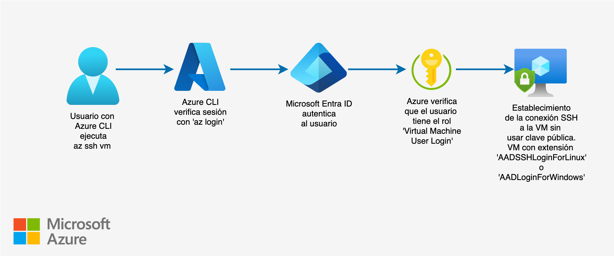

# 🛠️ Terraform Microsoft Azure Demos 

[](https://azure.microsoft.com)
[](#)
[](#)

- Este repositorio contiene una serie de demos prácticas que muestran cómo utilizar Terraform para desplegar y gestionar recursos en **Microsoft Azure**. 
- El objetivo es proporcionar ejemplos básicos y avanzados que sirvan como referencia para implementar infraestructuras reproducibles y escalables.
- Cada demo cubre un escenario específico, desde configuraciones básicas hasta despliegues más avanzados.

---

## 📂 Contenido
### Ejemplos Virtual Networks (VNet)
- [Virtual Network con una subnet](https://github.com/samuelrojasm/demo-terraform-azure/tree/main/virtual-networks/vnet-basic)
### Ejemplos Virtual Machine (VM)
- [VM Linux (Entra ID + RBAC)](https://github.com/samuelrojasm/demo-terraform-azure/tree/main/virtual-machines/vm-linux-instance)
- [Crear múltiples VM Linux (ssh clásico)](https://github.com/samuelrojasm/demo-terraform-azure/tree/main/virtual-machines/vm-same-image)
- [Crear múltiples VM Linux (Entra ID + RBAC)](https://github.com/samuelrojasm/demo-terraform-azure/tree/main/virtual-machines/vm-linux-multiple)
### Ejemplos Azure Blob (Binary Large Object) Storage
- [Blob para backend remoto de Terraform state](https://github.com/samuelrojasm/demo-terraform-azure/tree/main/blob-storage/blob-terraform-state)
- [Almacenar el estado de Terraform en Azure Storage](https://github.com/samuelrojasm/demo-terraform-azure/tree/main/blob-storage/blob-tf-backend-state)

## 🚀 **Requisitos**
- [Terraform](https://developer.hashicorp.com/terraform/downloads)
- Cuenta de **Azure** con permisos adecuados:
    - En mi caso uso un usuario de Azure con el rol: **```Contributor```** de Azure RBAC (Role-Based Access Control)
    - Este rol se asigna en: ```Azure subscription -> Access control (IAM) -> Add role assignment -> Role -> Privileged administrator roles```

- Azure CLI instalado:
    ```bash
    brew install azure-cli
    ```
- Login 
    - Método interactivo (usando el navegador)
        ```bash
        az login
        ```
    - Método con autenticación interactiva en CLI (sin navegador)
        ```bash
        az login --use-device-code
        ```
- Configurar la variable de entorno:
    ```bash
    export ARM_SUBSCRIPTION_ID="<SUBSCRIPTION_ID>"
    ```
---

## ⚙️ Estructura del repositorio
```
📁 Recurso-Azure                     # Servicio específico de Azure  
 ├── /nombre-demo-azure              # Nombre que describe la demo  
 │      ├── main.tf                  # Configuración principal  de Terraform
 │      ├── variables.tf             # Declaración de variables (Variables utilizadas)
 │      ├── outputs.tf               # Salidas de Terraform  
 │      ├── providers.tf             # Configuración del proveedor (Azure)  
 │      ├── README.md                # Explicación del ejemplo   
 │      └── terraform.tfvars         # Valores para las variables 
 └── ...                             # Más ejemplos  
📁 modules                           # Módulos reutilizables  
📄 README.md                         # Explicación general del repositorio  
```

---

## 💻 Uso de comandos de Terraform
- Inicializa la configuración de Terraform
    ```bash
    terraform init
    ```

- Versión específica del proveedor que Terraform ha seleccionado
    ```bash
    terraform providers
    ```

- Aplica formato y valida la configuración
    ```bash
    terraform fmt
    terraform validate
    ```

- Aplica la configuración de Terraform
    ```bash
    terraform apply
    ```

- Inspeccionar el estado
    ```bash
     # Estado actual
    terraform show
     # Listar los recursos creados
    terraform state list
    ```

- Destruye la infraestructura si ya no se requiere
    ```bash
    terraform destroy
    ```

---

## 🎯 Prácticas recomendadas

- Usar variables y archivos **`.tfvars`** para manejar configuraciones reutilizables.
- Aplicar módulos para evitar repetición de código.
- Usar **`terraform fmt`** y **`terraform validate`** para mantener un código limpio y coherente.

---

## 🔐 Autenticación Segura a Virtual Machine con Entra ID + RBAC Access
- **`Configurar inicio de sesión con Entra ID para la VM`**: Para acceder a una máquina virtual (VM) en Azure utilizando **Managed Identity** y **Microsoft Entra ID** (anteriormente Azure AD).
- **`Permite autenticarse a través de identidades corporativas`**: Evita usar credenciales locales como **usuario/contraseña** o **claves SSH**. 
- **`Login with Microsoft Entra ID`**: Esta opción habilita el inicio de sesión en la VM usando identidades de Microsoft Entra ID. Permitir que usuarios autenticados por Entra ID accedan a la VM **(RDP o SSH con AAD)**.
- **`Enable system assigned managed identity`**: Crea una identidad administrada asignada por el sistema (Managed Identity) ligada a la VM. Esta identidad puede usarse para autenticarse en servicios de Azure sin necesidad de credenciales.

### Ventajas
- Sin gestión de claves privadas
- Acceso controlado mediante RBAC
- Auditoría centralizada en Entra ID
- Compatible con `az ssh` para Linux o RDP para Windows

### Requisitos previos
- Tener una cuenta con permisos suficientes en la VM.
- La VM debe estar unida a Microsoft Entra ID.
- Estar utilizando una imagen de Windows Server 2019 o posterior o Ubuntu 20.04 o posterior.
- Tener Azure CLI instalado y autenticado (az login).
### Paso 1: Habilitar Entra ID Login en la VM
- Extensión para Linux
    ```bash
    AADSSHLoginForLinux
    ```
- Extensión para Windows
    ```bash
    AADLoginForWindows
    ```
### Paso 2: Habilitar system assigned managed identity (identidad administrada)
- La extensión AADLogin/AADSSHLogin necesita una identidad asignada a la VM para poder:

    - Realizar validaciones de token Entra ID
    - Consultar permisos (RBAC) en el contexto de la VM
    - Hacer llamadas a la API de Entra ID desde la VM
    
- Habilitar una identidad administrada para que la VM acceda de forma segura a otros recursos Azure
    ```hcl
    identity {
        type = "SystemAssigned"
    }
    ```
### Paso 3: Asignar roles Entra ID al usuario
- Asignar uno de los siguientes roles Entra ID al usuario que accederá a la VM:
    ```bash
    # admin remoto, acceso con permisos elevados
    Virtual Machine Administrator Login
     ```
     ```bash
    # usuario remoto sin privilegios de admin, acceso limitado
    Virtual Machine User Login
    ```
### Paso 4: Conexión a la VM
- Para la conexión con Linux
    1. Instalar el plugin **Azure CLI SSH**
        ```bash
        az extension add --name ssh
        ```
    2. Conexión
        - Linux: Conectar con Azure CLI
            ```sh
            az ssh vm \
                --name <nombre-vm> \
                --resource-group <grupo-recursos> \
            ```
        - Windows: Acceso vía RDP
            ```sh
            # Usa las credenciales de Entra ID al conectar por RDP
            Usuario: AzureAD\usuario@dominio.com
            ```
### Diagrama de Arquitectura
- Este diagrama muestra cómo los usuarios autenticados por Microsoft Entra ID pueden acceder a una VM usando RBAC y la CLI de Azure (`az ssh`).

    - Autenticación del usuario con Entra ID
    - Evaluación de permisos RBAC
    - Acceso a la VM mediante az`ssh` o`RDP`

<br>
<p align="center">
  
</p>
<br>

---

## 📚 Referencias
- [Terraform - Azure Provider](https://registry.terraform.io/providers/hashicorp/azurerm/latest/docs)
- [Define your naming convention](https://learn.microsoft.com/en-us/azure/cloud-adoption-framework/ready/azure-best-practices/resource-naming)
- [Build Azure infrastructure](https://developer.hashicorp.com/terraform/tutorials/azure-get-started/azure-build)
- [Azure regions](https://azure.microsoft.com/en-us/explore/global-infrastructure/geographies/)
- [Azure regions mapping list](https://github.com/claranet/terraform-azurerm-regions/blob/master/REGIONS.md)
- [Azure classic subscription administrators](https://learn.microsoft.com/en-us/azure/role-based-access-control/classic-administrators)
- [What is Azure Resource Manager?](https://learn.microsoft.com/en-us/azure/azure-resource-manager/management/overview)

## 🔐 Referencias -  Autenticación Segura Entra ID + RBAC Access
- [What is Azure role-based access control (Azure RBAC)?](https://learn.microsoft.com/en-us/azure/role-based-access-control/overview)
- [What are managed identities for Azure resources?](https://learn.microsoft.com/en-us/entra/identity/managed-identities-azure-resources/overview)
- [Sign in to a Linux virtual machine in Azure by using Microsoft Entra ID and OpenSSH](https://learn.microsoft.com/en-us/entra/identity/devices/howto-vm-sign-in-azure-ad-linux)
- [Sign in to a Windows virtual machine in Azure by using Microsoft Entra ID including passwordless](https://learn.microsoft.com/en-us/entra/identity/devices/howto-vm-sign-in-azure-ad-windows)
- [Assign Azure roles using the Azure portal](https://learn.microsoft.com/en-us/azure/role-based-access-control/role-assignments-portal)
- [Overview of role-based access control in Microsoft Entra ID](https://learn.microsoft.com/en-us/entra/identity/role-based-access-control/custom-overview)
- [Azure built-in roles](https://learn.microsoft.com/en-us/azure/role-based-access-control/built-in-roles)
- [Microsoft Entra built-in roles](https://learn.microsoft.com/en-us/entra/identity/role-based-access-control/permissions-reference)

## 📦 Referencias -  Azure Blob Storage
- [Introduction to Azure Storage](https://learn.microsoft.com/en-us/azure/storage/common/storage-introduction)
- [Herramientas o productos de Azure Storage](https://azure.microsoft.com/es-es/products/category/storage)
- [Store Terraform state in Azure Storage](https://learn.microsoft.com/en-us/azure/developer/terraform/store-state-in-azure-storage?tabs=azure-cli)

---
