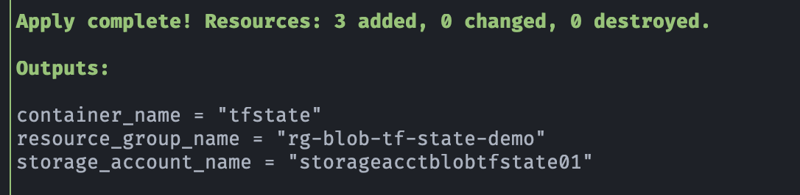

## 🛠️  Demo: Azure Blob Storage - Almacenamiento para el estado de Terraform

## 🎯 Objetivo (Target)
- Proporcionar los recursos mínimos necesarios para habilitar el uso de **azurerm** como backend remoto para otros proyectos Terraform.
- Recursos que se crean:
    - Azure Resource Group
    - Azure Storage Account (tipo StorageV2, replicación LRS)
    - Blob Container privado (tfstate)

---

## 🚀 Resultado (Outcome)
### Terraform apply (outputs)
- El output incluirá el nombre del **storage_account** y del **container**, necesarios para configurar el backend remoto en otros proyectos.

### Terraform state list

### Storage Account de Azure Blob Storage
 

    
    

### Container remoto pare el estado de Terraform en Azure Blob Storage
 

    
    

---

## 📚 Referencias
- [Introduction to Azure Storage](https://learn.microsoft.com/en-us/azure/storage/common/storage-introduction)
- [Herramientas o productos de Azure Storage](https://azure.microsoft.com/es-es/products/category/storage)
- [Store Terraform state in Azure Storage](https://learn.microsoft.com/en-us/azure/developer/terraform/store-state-in-azure-storage?tabs=azure-cli)