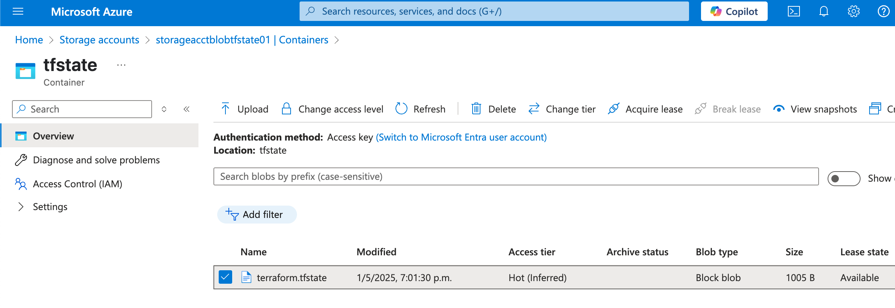

## 🛠️  Demo: Azure Blob Storage - Almacenar el estado de Terraform en Azure Storage

[](https://azure.microsoft.com)
[](#)
[](#)

## 🎯 Objetivo (Target)
- En versiones recientes de Terraform (desde v1.1 en adelante), se peude usar el **bloque backend** dentro de terraform {} para definir el almacenamiento remoto del estado, incluyendo Azure como **backend** a través de **Azure Blob Storage**.

---

## ✅ Prerequisitos
- Para usar la función de **backend state** es necesario tener listo los siguientes recursos:
    - Azure Resource Group (correspondinete al Azure Blob definido para almacenar el estado de Terraform)
    - Azure Storage Account
    - Azure Container 
- Para configurar el estado de backend, necesita la siguiente información de almacenamiento Azure:
    - `**storage_account_name**`: El nombre de Azure Storage account.
    - `**container_name**`: El nombre del blob container.
    - `**key**`: El nombre del archivo del almacenamsiento de estado que se va a generar.
- Este el bloque de código del  **backend state** que se adiciona en el proyecto de Terraform
    ```hcl
    backend "azurerm" {
      resource_group_name  = "rg-blob-tf-state-demo"
      storage_account_name = "<storage_account_name>"
      container_name       = "tfstate"
      key                  = "terraform.tfstate"
    }
    ```
---

## 🚀 Resultado (Outcome)
### Terraform init
- Al ejecutar **terraform init** valida los parámetros y acceso al Azure Blob Storage definido en el bloque **backend**
- Se crea el archivo **terraform.tfstate** en el **Container** tfstate de Azure Blob Storage
<p align="center">

</p>

---

## 📚 Referencias
- [Store Terraform state in Azure Storage](https://learn.microsoft.com/en-us/azure/developer/terraform/store-state-in-azure-storage/)

---