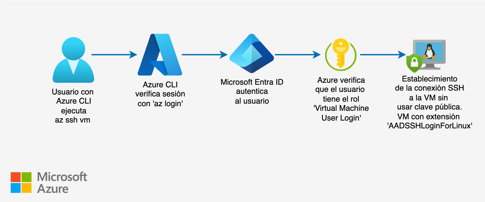
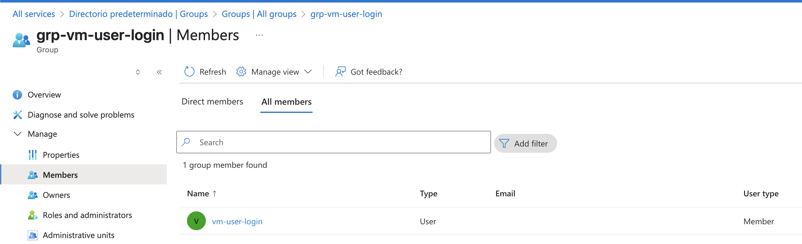
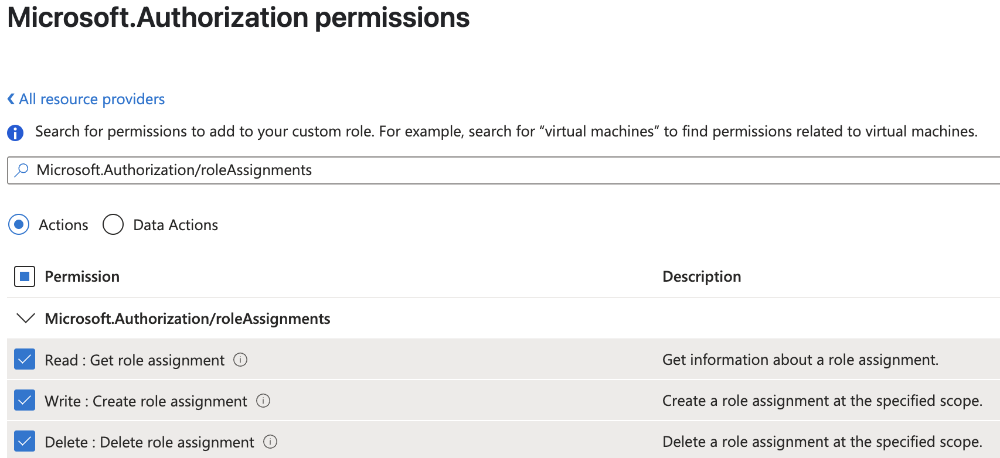
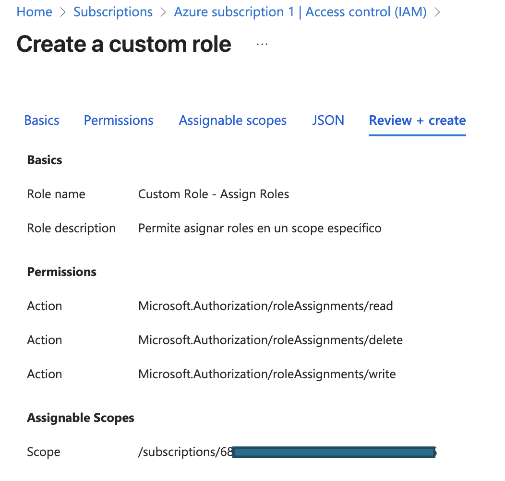
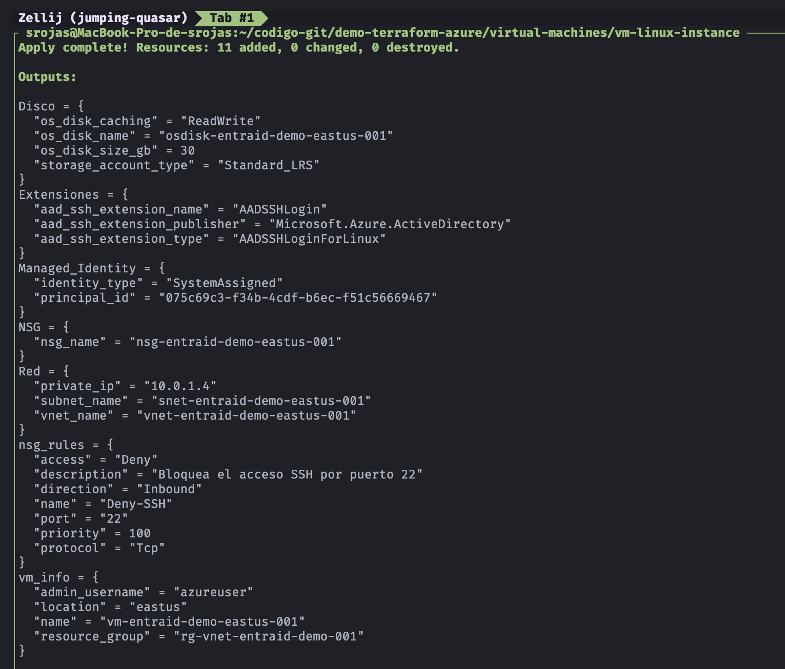

## 🛠️  Demo: Azure Virtual Machine Linux

[](https://azure.microsoft.com)
[](#)
[](#)

## 🎯 Objetivo (Target)
Este ejemplo ejecuta las siguientes acciones: 
- Activa el acceso a la VM con Microsoft Entra ID (az ssh vm)
    - Para permitir que usuarios inicien sesión en la máquina virtual Linux en Azure utilizando credenciales de Microsoft Entra ID y el comando **az ssh vm**
- Crea un Grupo de Recursos (RG)
- Asigna el rol: **`Virtual Machine User Login`** al grupo creado previamente (por ejemplo: grp-vm-user-login)
- Crea una VM Linux
- Instalar en la VM la extensión **`AADSSHLoginForLinux`**, permite validar y aceptar las credenciales de Microsoft Entra ID para conexión SSH
- Activar en la VM **`System Assigned Managed Identity`**
- Uso de los proveedores de Azure Resource Manager (**`azurerm`**) y Microsoft Entra ID (**`azuread`**).

<br>
<p align="center">
  
</p>
<br>

---

## ✅ Prerequisitos
Previo a la ejecución es necesario tener listo los siguientes recursos:
1. Usuario de Entra ID (por ejemplo: vm-user-login)
2. Grupo de Entra ID (por ejemplo: grp-vm-user-login)
3. Agregar usuario al grupo

<br>
<p align="center">
  
</p>
<br>

4. Rol personalizado para el **usuario azure** que ejecuta los comandos de Terraform
    - Este rol se necesita para poder asignar el rol **Virtual Machine User Login**
    - Opción rol personzalido:
        ```bash
        Subscriptions -> <Azure_subscription_name> -> Access control (IAM) -> Create a custom role -> Add
        ```
    - En la pestaña "basic"
        ```bash
        Custom role name: Custom Role - Assign Roles
        Description: Permite asignar roles en un scope específico.
        ```
    - En la pestaña "permissions" -> Add permissions
        ```bash
        Search for permission -> Microsoft.Authorization/roleAssignments
        ```
    - Marcar las siguientes acciones y presionar "Add"
        ```bash
        Microsoft.Authorization/roleAssignments/write
        Microsoft.Authorization/roleAssignments/delete
        Microsoft.Authorization/roleAssignments/read
        ```
    <br>
    <p align="center">
    
    </p>
    <br>

    - En la pestaña: "Assignable scopes"
        ```bash
        Assignable scope -> Subscription
        ```
    - Hacer click en "Review + create" + "Create"

    <br>
    <p align="center">
    
    </p>
    <br>

5. Asignar este rol personalizado al **usuario azure** que ejecuta los comandos de Terraform
    - Asignar el rol:
        ```bash
        Subscriptions -> <Azure_subscription_name> -> Access control (IAM) -> Add role assignment -> Privileged administrator roles
        ```
    - En la pestaña "Conditions" restingir los privilegios que puede asignar
        ```bash
        Condition -> Select roles and principals -> Constrain roles (Allow user to only assign roles you select)
        Configure -> Add Rol -> Job function roles -> Virtual Machine User Login
        ```
    - Hacer click en "Review + assign"

---

## 🚀 Resultado (Outcome)
### Terraform apply
<p align="center">

</p>

### Resource map (Private Subnets)


---