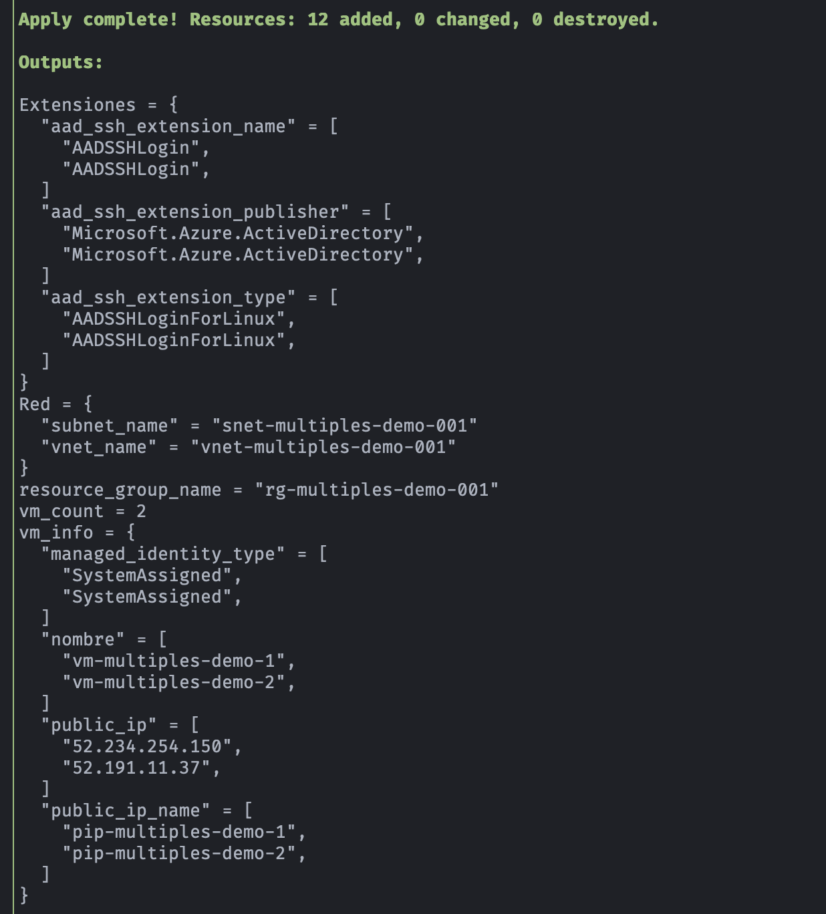
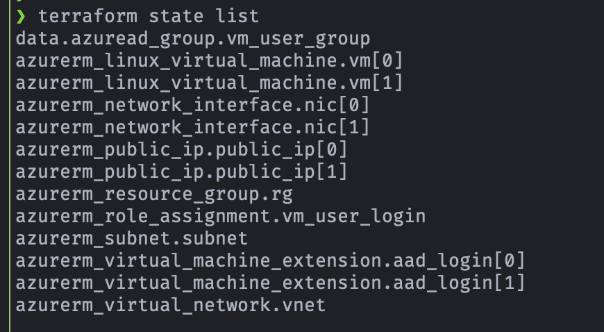
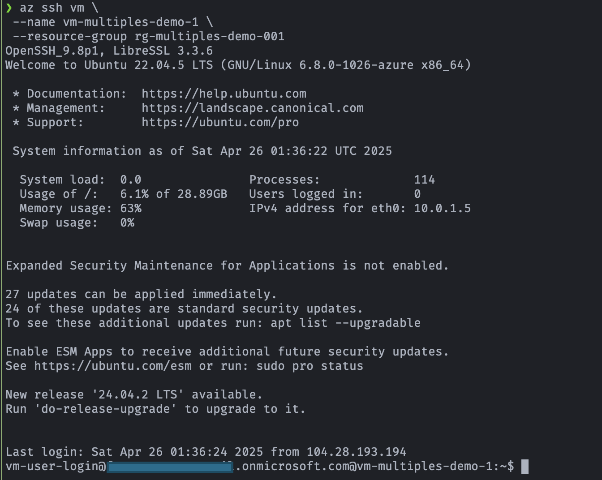

## 🛠️  Demo: Azure Virtual Machine Linux acceso con Entra ID + RBAC (múltiples VM de la misma imagen)

[](https://azure.microsoft.com)
[](#)
[](#)

## 🎯 Objetivo (Target)
- Este proyecto despliega múltiples máquinas virtuales Linux en Azure usando Terraform.
- Autenticación con **Entra ID + RBAC** (sin contraseña).
- Recursos que se crean:
    - Grupo de recursos
    - Red virtual y subred
    - IP pública
    - NIC
    - Disco
    - Múltiples máquinas virtuales Linux (Ubuntu 22.04)
- Cada VM debe tener su propia:
    - NIC
    - IP pública
    - Disco OS
    - Nombre único

---

## ✅ Prerequisitos
- Previo a la ejecución es necesario tener listo los siguientes recursos:

1. Crear par de llaves (privada y pública)
    - Se requiere la llave púbica para poder crear las VMs
    - Para la creación del par de llaves se ejecuta:
        ```bash
        ssh-keygen -t rsa -b 4096 -f ~/.ssh/dummy_key -N ""
        ```
    - Crear directorio en el módulo principal de Terraform y copiar llave pública
        ```bash
        mkdir .ssh
        cd .ssh
        cp ~/.ssh/dummy_key.pub .
        ```
2. Crear grupo de Entra ID (por ejemplo: grp-vm-user-login)
3. Crear usuario de Entra ID (por ejemplo: vm-user-login) 
4. Asignar usuario (vm-user-login) al grupo (grp-vm-user-login)
5. Crear Rol personalizado para el usuario azure que ejecuta los comandos de Terraform
    - Permisos requeridos
        ```bash
        Microsoft.Authorization/roleAssignments/write
        Microsoft.Authorization/roleAssignments/delete
        Microsoft.Authorization/roleAssignments/read
        ```
6. Asignar este rol personalizado al usuario azure que ejecuta los comandos de Terraform

---

## 🚀 Resultado (Outcome)
### Terraform apply (outputs)
<p align="center">

</p>

### Terraform state list
<p align="center">

</p>

### Acceso a las VMs Linux
- Instalar el plugin Azure CLI SSH
    ```bash
    az extension add --upgrade -n ssh
    az extension show --name ssh
    ```
- Login de usuario con permiso de acceder por az ssh
    ```bash
    az login --use-device-code
    ```
- Verificar cuenta actual 
    ```bash
    az account show
    ```
- Acceso a VM 01 con Entra ID + RBAC (sin contraseña o llave privada)
    ```bash
    az ssh vm \
    --name vm-multiples-demo-1 \
    --resource-group rg-multiples-demo-001
    ```
    <p align="center">
    
    </p>
- Acceso a VM 02 con Entra ID + RBAC (sin contraseña o llave privada)
    ```bash
    az ssh vm \
    --name vm-multiples-demo-2 \
    --resource-group rg-multiples-demo-001
    ```
---