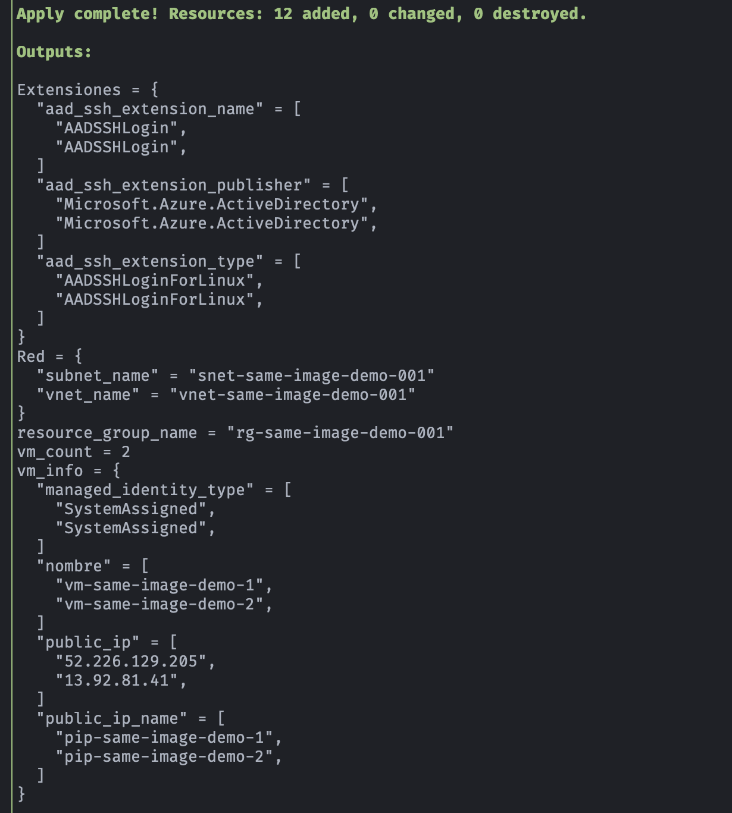
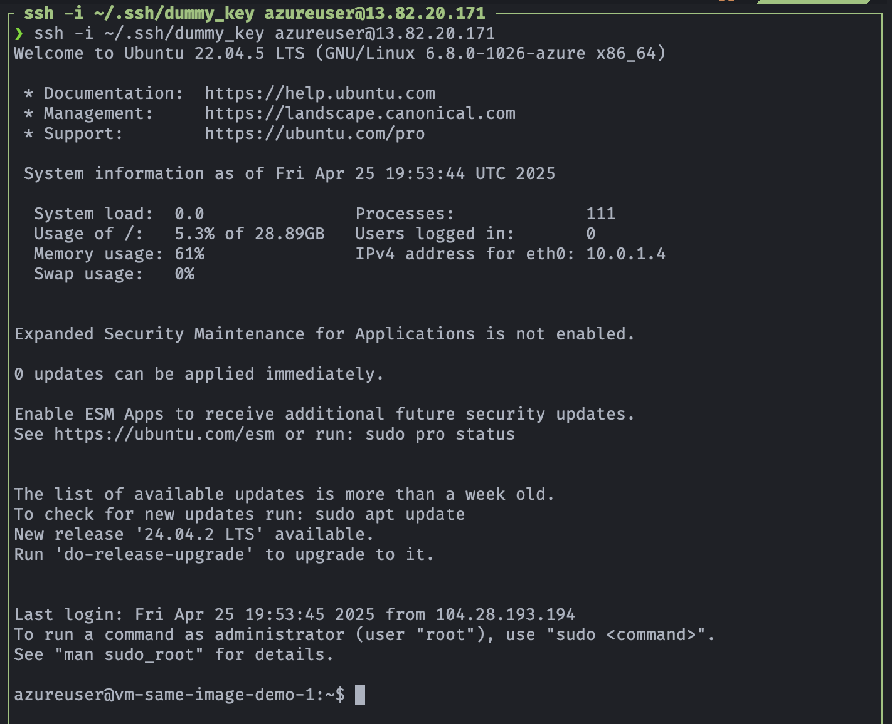
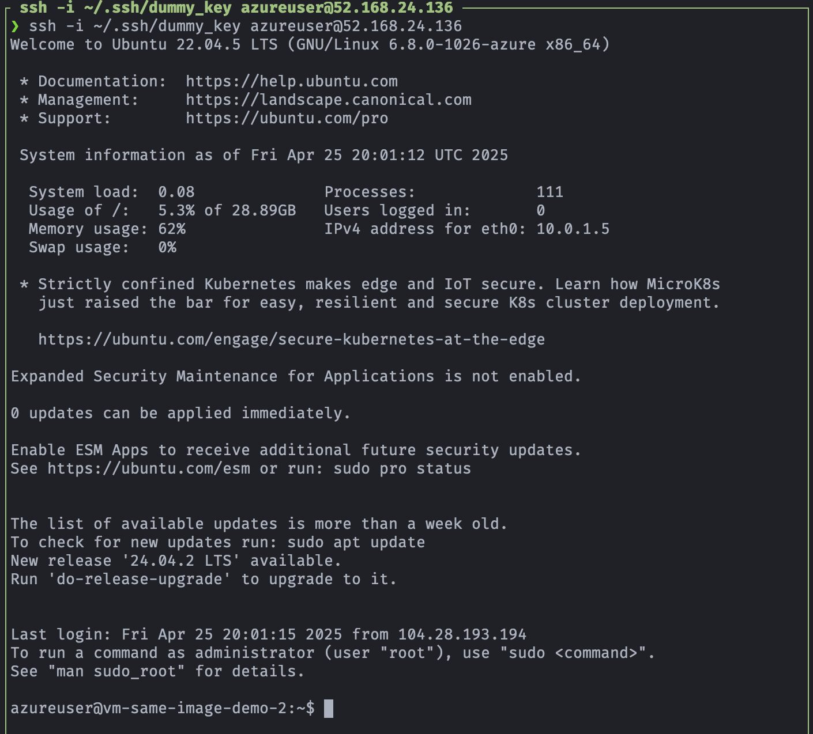

## 🛠️  Demo: Azure Virtual Machine Linux con SSH (múltiples VM de la misma imagen)

[](https://azure.microsoft.com)
[](#)
[](#)

## 🎯 Objetivo (Target)
- Este proyecto despliega múltiples máquinas virtuales Linux en Azure usando Terraform.
- Autenticación por **llave pública SSH** (sin contraseña).
- Recursos que se crean:
    - Grupo de recursos
    - Red virtual y subred
    - IP pública
    - NIC
    - Disco
    - Múltiples máquinas virtuales Linux (Ubuntu 22.04)
- Cada VM debe tener su propia:
    - NIC
    - IP pública
    - Disco OS
    - Nombre único

---

## ✅ Prerequisitos
- Previo a la ejecución es necesario tener listo los siguientes recursos:

1. Crear par de llaves (privada y pública)
    - Se requiere la llave púbica para poder crear y acceder a las VMs
    - Para la creación del par de llaves se ejecuta:
        ```bash
        ssh-keygen -t rsa -b 4096 -f ~/.ssh/dummy_key -N ""
        ```
    - Crear directorio en el módulo principal de Terraform y copiar llave pública
        ```bash
        mkdir .ssh
        cd .ssh
        cp ~/.ssh/dummy_key.pub .
        ```

---

## 🚀 Resultado (Outcome)
### Terraform apply (outputs)
<p align="center">

</p>

### Acceso a la VM Linux
- Acceso a VM 01 con llave privada
    ```bash
    ssh -i ~/.ssh/dummy_key azureuser@13.82.20.171
    ```
    <p align="center">
    
    </p>

- Acceso a VM 02 con llave privada
    ```bash
    ssh -i ~/.ssh/dummy_key azureuser@52.168.24.136
    ```
    <p align="center">
    
    </p>
    
---